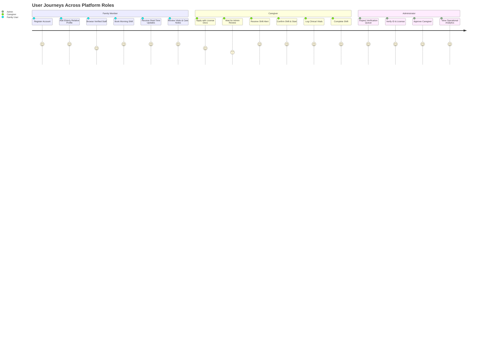
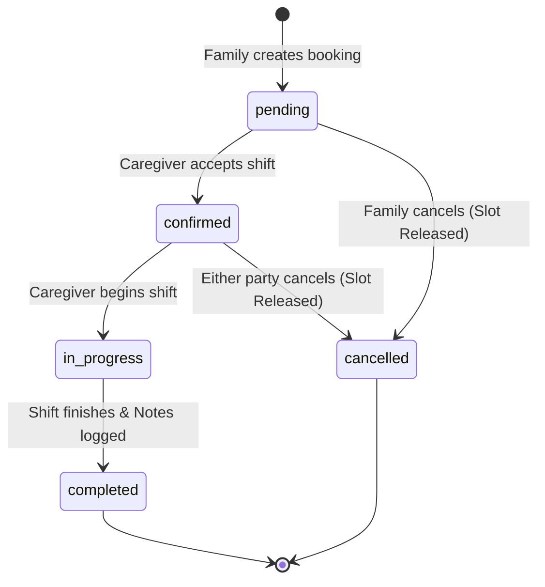

# 🌿 CareElderly — Elderly Nursing & Healthcare Assistance Platform

[](https://opensource.org/licenses/MIT)
[](https://nodejs.org/)
[](https://react.dev/)
[](https://vitejs.dev/)
[](https://tailwindcss.com/)
[](https://socket.io/)
[](https://expressjs.com/)
[](#-testing--automated-verification)

> A modern, production-grade, full-stack healthcare assistance web platform connecting senior citizens and their families with verified, licensed healthcare professionals (nurses, physiotherapists, attendants) for structured in-home care. Built with real-time clinical care logs, conflict-free shift scheduling, dual-mode data persistence, and an administrative credential verification portal.

---

## 📌 Table of Contents

- [Vision & Core Problem](#-vision--core-problem)
- [Key Features](#-key-features)
- [System Architecture](#-system-architecture)
- [Tech Stack](#-tech-stack)
- [Role-Based Workflows](#-role-based-workflows)
- [Conflict Prevention & Booking Lifecycle](#-conflict-prevention--booking-lifecycle)
- [Quick Start & Installation](#-quick-start--installation)
- [Pre-Seeded Demo Accounts](#-pre-seeded-demo-accounts)
- [REST API Reference](#-rest-api-reference)
- [Testing & Automated Verification](#-testing--automated-verification)
- [Project Structure](#-project-structure)
- [Security & Architecture Hardening](#-security--architecture-hardening)
- [Roadmap & Enhancements](#-roadmap--enhancements)
- [License](#-license)

---

## 💡 Vision & Core Problem

Aging populations often require dedicated post-operative care, palliative assistance, or chronic disease management at home. However, families struggle with:
1. **Lack of Trust & Credential Verification**: Unvetted caregivers posing safety and medical risks.
2. **Fragmented Communication**: Family members having zero visibility into what transpires during care shifts.
3. **Double-Booking & Scheduling Chaos**: Unreliable shifts and conflicting schedules.
4. **Clinical Data Discontinuity**: Missing records of vital signs (blood pressure, blood glucose, SpO2) between doctor visits.

**CareElderly** solves this by establishing a secure, end-to-end operational platform combining identity verification, double-booking prevention, real-time WebSocket notifications, and structured clinical care note logging.

> **Zero-Payment Policy**: In strict accordance with the platform specification, online payment gateway processing is intentionally excluded. Shift prices are calculated and displayed solely as transparent informational cost estimates.

---

## ✨ Key Features

### 👨‍👩‍👧 For Families & Senior Citizens
- **Elderly Patient Profiles**: Manage comprehensive clinical records for relatives including chronic conditions, active medications, blood group, mobility status (*ambulatory*, *walker*, *wheelchair*, *bedridden*), and emergency contacts.
- **Ownership Isolation Guard**: Strict multi-tenant security ensures families can only access and book care for their registered relatives (`403 Forbidden` enforced server-side).
- **Caregiver Directory & Advanced Filtering**: Browse verified medical staff filtered by specialization (*Registered Nurse*, *Physiotherapist*, *Attendant*), locality, minimum ratings (4.5★+), and availability.
- **Smart Shift Scheduling Wizard**: Interactive booking flow checking real-time caregiver calendars to guarantee zero scheduling conflicts.
- **Live Clinical Care Notes Timeline**: Monitor vital signs logged during shifts in real time without refreshing the page.
- **Instant Shift Cancellation**: Free booked slots immediately if plans change, returning the shift to the public availability pool.

### 🩺 For Caregivers (Nurses, Physiotherapists, Attendants)
- **Credentialed Onboarding**: Register with nursing licenses, qualifications, and legal identity documents. New accounts remain in a protected `pending` state until reviewed by an administrator.
- **Real-Time Shift Inbox**: Receive incoming hire requests via WebSocket notifications and accept or decline shifts.
- **Lifecycle Shift Tracker**: Step-by-step state management (`pending` $\to$ `confirmed` $\to$ `in_progress` $\to$ `completed`).
- **Digital Clinical Care Note Logging**: Record objective medical vitals during active shifts:
  - Blood Pressure (e.g., `120/80 mmHg`)
  - Heart Rate / Pulse (`bpm`)
  - Temperature (`°F`)
  - Blood Glucose (`mg/dL`)
  - Oxygen Saturation (`SpO2 %`)
  - Tasks executed & behavioral observations.

### 🛡️ For Platform Administrators
- **Caregiver Credential Inspection Queue**: Review license numbers, uploaded identification documents, and background submissions.
- **1-Click Approvals & Structured Feedback**: Instantly approve caregivers to activate their public directory profile or provide structured rejection reasoning.
- **Executive Operational KPI Dashboard**: Real-time platform metrics aggregating active shifts, verified staff ratio, patient volume, and booking statuses.


## 🛠️ Tech Stack

### Frontend
- **Framework**: [React 19](https://react.dev/) + [Vite 8](https://vitejs.dev/)
- **Styling**: [Tailwind CSS v4](https://tailwindcss.com/)
- **Icons**: [Lucide React](https://lucide.dev/)
- **State & Context**: React Context API (AuthContext, SocketContext)
- **Forms & Validation**: [React Hook Form](https://react-hook-form.com/) + [Zod](https://zod.dev/)
- **Networking**: [Axios](https://axios-http.com/) (configured with in-memory token attach and automated 401 refresh interceptors)
- **Real-Time Client**: [Socket.io-client](https://socket.io/)
- **Notifications**: [Sonner](https://sonner.emilkowal.ski/) Toasts

### Backend
- **Runtime**: [Node.js](https://nodejs.org/) (LTS)
- **Framework**: [Express.js 4](https://expressjs.com/)
- **Real-Time Engine**: [Socket.io 4](https://socket.io/) (room-isolated per authenticated user)
- **Database & ORM**: [Mongoose 8](https://mongoosejs.com/) (MongoDB) + **Atomic In-Memory Store Adapter**
- **Authentication**: JWT (`jsonwebtoken`) + [bcryptjs](https://github.com/dcodeIO/bcrypt.js) password hashing + Google OAuth
- **Security & Hardening**: [Helmet](https://helmetjs.github.io/), [express-rate-limit](https://express-rate-limit.mintlify.app/), [cookie-parser](https://github.com/expressjs/cookie-parser) (`SameSite=Strict`, `HttpOnly` refresh tokens)
- **Transactional Email**: [Nodemailer](https://nodemailer.com/) (SMTP with zero-config console fallback)

---

## 👥 Role-Based Workflows



---

## ⏱️ Conflict Prevention & Booking Lifecycle

### Double-Booking Prevention Algorithm
To protect patients and healthcare workers, `backend/controllers/bookingController.js` enforces strict collision checks:
1. Validates the caregiver's existing shifts on the selected date.
2. Checks slot overlap rules:
   - Exact slot collisions (e.g., `Morning` vs `Morning`)
   - `24 Hours` shifts block all morning, afternoon, evening, and night slots.
   - `Day Shift` blocks morning and afternoon slots.
3. If an overlap is detected on any `pending`, `confirmed`, or `in_progress` shift, the API immediately rejects the request with **HTTP `409 Conflict`** (`SLOT_ALREADY_BOOKED`).
4. When a user cancels a shift, the status moves to `cancelled`, and the calendar slot is instantly freed for other families.



---

## 🚀 Quick Start & Installation

### Prerequisites
- [Node.js](https://nodejs.org/) v18.0.0 or higher
- [npm](https://www.npmjs.com/) v9.0.0 or higher
- *(Optional)* [MongoDB](https://www.mongodb.com/) (If MongoDB is not installed, the platform **automatically runs in zero-config In-Memory mode**!)

### 1. Clone the Repository
```bash
git clone https://github.com/your-username/caregiver-platform.git
cd caregiver-platform
```

### 2. Backend Setup
```bash
cd backend
npm install
```


Start the backend server:
```bash
# Development mode with hot-reloading
npm run dev

# Or standard start
npm start
```
*The server will start at `http://localhost:5000` with pre-seeded demo accounts ready for use.*

### 3. Frontend Setup
In a new terminal window:
```bash
cd frontend
npm install
```

Create a `.env` file in the `frontend/` directory (or copy from `.env.example`):
```env
VITE_API_BASE_URL=http://localhost:5000/api/v1
```

Start the frontend development server:
```bash
npm run dev
```
*Open `http://localhost:5173` in your browser.*

---

## 🔑 Pre-Seeded Demo Accounts

The platform includes pre-seeded demo credentials for instant 1-click testing. On the `/login` page, you can either click the **1-Click Test Login Presets** or manually enter:

| Role | Email | Password | Pre-loaded Data / Capabilities |
|---|---|---|---|
| 👨‍👩‍👧 **Family User** | `vikram@careelderly.org` | `password123` | Linked patient (*Savitri Devi*), existing booking history |
| 🩺 **Nurse Caregiver** | `anita.nurse@careelderly.org` | `password123` | Verified Registered Nurse, assigned shifts, can log vitals |
| 🛡️ **Platform Admin** | `admin@careelderly.org` | `password123` | Full access to `/admin` and `/admin/verifications` queue |
| ⏳ **Pending Caregiver** | `pending.caregiver@careelderly.org` | `password123` | Awaiting admin review (ideal for testing verification flow) |

---

## 📡 REST API Reference

All primary endpoints are prefixed with `/api/v1`.

### 🔐 Authentication (`/api/v1/auth`)
| Method | Endpoint | Access | Description |
|---|---|---|---|
| `POST` | `/auth/register` | Public | Register new Family User or Caregiver |
| `POST` | `/auth/login` | Public | Login with email/password; receives access token & sets HttpOnly cookie |
| `POST` | `/auth/google` | Public | Authenticate via Google OAuth credential |
| `GET` | `/auth/me` | Bearer | Get authenticated user profile |
| `POST` | `/auth/refresh` | Public (Cookie) | Rotate and refresh access token |
| `POST` | `/auth/logout` | Bearer | Clear refresh token cookie & terminate session |
| `GET` | `/auth/verify-email` | Public | Verify email address using cryptographic token |
| `POST` | `/auth/resend-verification` | Bearer | Re-trigger verification email dispatch |

### 👵 Elderly Patients (`/api/v1/patients`)
| Method | Endpoint | Access | Description |
|---|---|---|---|
| `GET` | `/patients` | Bearer (User/Admin) | List caller's registered elderly patients |
| `POST` | `/patients` | Bearer (User/Admin) | Register new patient with medical history & vitals baseline |
| `GET` | `/patients/:id` | Bearer (Owner/Admin) | Get patient clinical profile (`403` if not owner) |
| `PUT` | `/patients/:id` | Bearer (Owner/Admin) | Update medical records or emergency contact |
| `DELETE` | `/patients/:id` | Bearer (Owner/Admin) | Remove patient record |

### 🏥 Healthcare Services & Catalog (`/api/v1/services`)
| Method | Endpoint | Access | Description |
|---|---|---|---|
| `GET` | `/services` | Public | List catalog services (filterable by `category`, `search`) |
| `GET` | `/services/:id` | Public | Retrieve single service details & pricing estimates |
| `POST` | `/services` | Bearer (Admin) | Add new healthcare service to catalog |

### 🩺 Caregiver Directory (`/api/v1/caregivers`)
| Method | Endpoint | Access | Description |
|---|---|---|---|
| `GET` | `/caregivers` | Public | List verified caregivers (`specialization`, `location`, `minRating`) |
| `GET` | `/caregivers/:id` | Public | View caregiver bio, verified licenses, and weekly availability |

### 📅 Shift Bookings (`/api/v1/bookings`)
| Method | Endpoint | Access | Description |
|---|---|---|---|
| `POST` | `/bookings` | Bearer (User) | Create new booking request with 409 conflict detection |
| `GET` | `/bookings` | Bearer | Retrieve bookings for current user or caregiver |
| `GET` | `/bookings/:id` | Bearer (Participant) | View booking details with populated patient & staff records |
| `PUT` | `/bookings/:id/status` | Bearer (Participant) | Transition shift state (`confirmed`, `in_progress`, `completed`, `cancelled`) |
| `GET` | `/bookings/availability` | Public | Query booked shifts for a specific caregiver and date |

### 📋 Clinical Care Notes & Vitals (`/api/v1/care-notes`)
| Method | Endpoint | Access | Description |
|---|---|---|---|
| `POST` | `/care-notes` | Bearer (Caregiver) | Log clinical observations and vitals (BP, HR, SpO2, Temp, Sugar) |
| `GET` | `/care-notes/booking/:bookingId` | Bearer (Participant) | Chronological vitals timeline for a specific care shift |
| `GET` | `/care-notes/patient/:patientId` | Bearer (Owner/Staff) | Full longitudinal clinical history for an elderly patient |

### 🛡️ Administrative Portal (`/api/v1/admin`)
| Method | Endpoint | Access | Description |
|---|---|---|---|
| `GET` | `/admin/caregivers/pending` | Bearer (Admin) | Retrieve queue of caregivers awaiting credential verification |
| `PUT` | `/admin/caregivers/:id/verify` | Bearer (Admin) | Approve caregiver license & activate public profile |
| `PUT` | `/admin/caregivers/:id/reject` | Bearer (Admin) | Reject caregiver submission with structured feedback |
| `GET` | `/admin/analytics` | Bearer (Admin) | Platform operational metrics, shift volumes, and ratios |

---

## 🧪 Testing & Automated Verification

The backend includes a comprehensive, multi-phase automated test suite with **100% test pass rate across 7 test suites (36+ assertions)**.

To execute all test suites sequentially:
```bash
cd backend
npm test
```

### Individual Test Suites
```bash
# 1. Core Domain Architecture & In-Memory Adapter
node backend/test_setup.js

# 2. Patient CRUD & Ownership Security Guard (403 Tests)
node backend/test_patient_routes.js

# 3. Healthcare Catalog & Caregiver Filtering
node backend/test_catalog_routes.js

# 4. Booking Engine & 409 Double-Booking Conflict Prevention
node backend/test_booking_routes.js

# 5. Care Notes Vitals & Socket.io Event Handlers
node backend/test_phase5_carenote_and_socket.js

# 6. Admin Verification Portal & KPI Analytics
node backend/test_admin_routes.js

# 7. Helmet Security Headers & Rate Limiting Hardening
node backend/test_step1_security_headers_and_ratelimit.js
```

### Frontend Build Verification
Verify production bundle compilation with zero errors:
```bash
cd frontend
npm run build
```


## 📄 License

This project is licensed under the [MIT License](LICENSE).

---

<p align="center">
  Built with ❤️ for seniors and their families.
</p>
